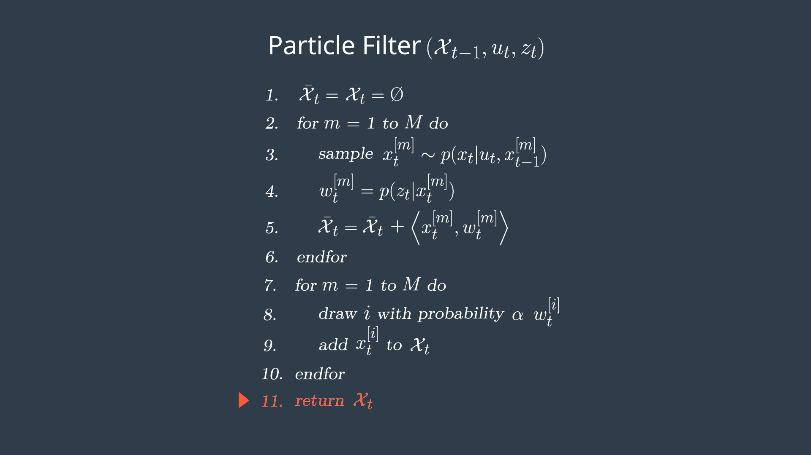
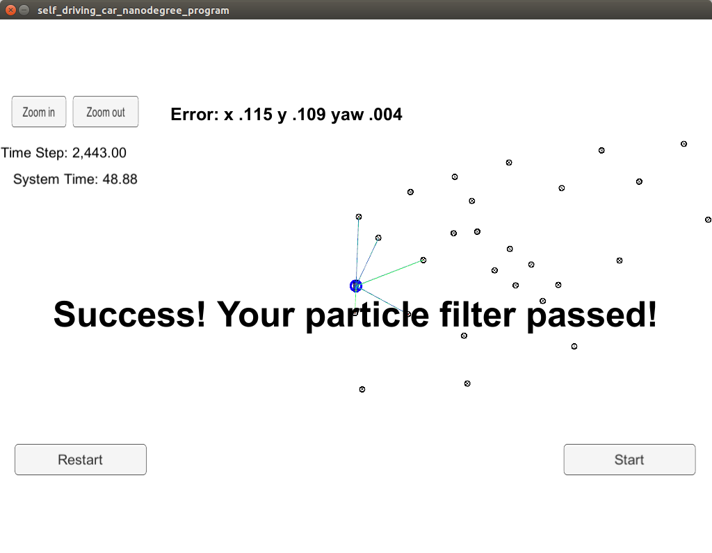

# PF_Cman
# Submission for Term2 Project 3: Particle Filter - "Kidnapped Vehicle" Localization

Objective: Implementing a 2 dimensional particle filter algorithm in C++ to solve a localization problem of a moving object of interest with noisy measurements and landmarks from an existing static map. 

>Environment setup, algorithm docu and boilerplate code provided by Udacity 
under https://github.com/udacity/CarND-Kidnapped-Vehicle-Project. 
Improvements where made to:

- src/particle_filter.cpp
- src/particle_filter.h

In particle_filter.cpp the steps shown in "Algorithm Flowchart" are implemented in functions: __init(), prediction(), dataAssociation(), updateWeights(), resample()__ and __SetAssociations()__. 

> "Algrithm Flowchart"

Besides the algorithm desribed in "Pseudocode" this requires implementing sampling from Gaussion distribution, Nearest Neighbor, Root Mean Squared Error, Homogenous Transformation of coordinates and Multivariate-Gaussian probability density.
> "Pseudodcode"

Passing the project requires obtaining RMSE values that are lower than the tolerance tested by the simulator, pls see project rubric https://review.udacity.com/#!/rubrics/747/view.

This project involves the Term 2 Simulator which can be downloaded here: https://github.com/udacity/self-driving-car-sim/releases. A server package uWebSocketIO is setting up a connection from the C++ program to the simulator, which acts as the host.

## Running the project
> Basic Build Instructions: Run shell-scripts from the project directory
1. ./clean.sh
2. ./build.sh
3. ./run.sh
5. Run and start the simulator

## Results
> RMSE is in expected limits.

